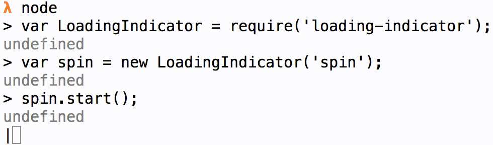

# loading-indicator

> Simple and customizable command line loading indicator

## Install
**Warning: `v2.0.0` is a complete rewrite of the previous implementation.**
```sh
$ npm install loading-indicator --save
```

## Usage



## API

## `fn.start([text], [options])`

Returns a `number` with the id that is used to reset the render interval (later referenced as _timer_).

### `text`

Type: `string`  
Default: `null`  

Text do append to the indicator symbol.

### `options`

Type: `object`  

Available options.

#### `options.delay`

Type: `number` _(milliseconds)_
Default: `100`  

Delay for the render to be triggered.

#### `options.frames`

Type: `array`  
Default: `presets.spinner`  

Frames for the loading animation sequence.

Available presets are:

* `spinner` (default)
* `circle`
* `dots`
* `bullets`
* `arrows`

## `fn.stop(timer, [shouldKeepOutput])`

### `timer`

_Required_  
Type: `number` _(integer)_

Id of the render function interval.

### `shouldKeepOutput`

Type: `boolean`  
Default: `false`  

Wether or not to keep the output when `fn.stop()` is called.

## License

MIT :copyright: [Rafael Rinaldi](http://rinaldi.io)
