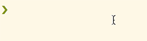
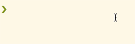
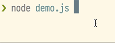

# loading-indicator [](https://semaphoreci.com/rafaelrinaldi/loading-indicator)

> Simple and customizable command line loading indicator

## Install
**Warning: `v2.0.0` is a complete rewrite of the previous implementation.**
```sh
$ npm install loading-indicator --save
```

## Usage

```js
import loading from 'loading-indicator';

// Initialize the loading animation and saves the timer id
const timer = loading.start();

// 1500ms later, stop the loading animation passing along the timer id
setTimeout(() => {
  loading.stop(timer);
}, 1500);
```



### Presets

```js
import loading from 'loading-indicator';
// Import available presets
import presets from 'loading-indicator/presets';

// Use an available preset (or simply provides an array with your custom preset)
const timer = loading.start(null, {
  frames: presets.arrows
});
```



### Custom text

```js
import loading from 'loading-indicator';

// Setup a custom loading text
const timer = loading.start('Loading...');
```



## API

## `loading.start([text], [options])`

Returns a `number` with the id that is used to reset the render interval (later referenced as _timer_).

### `text`

Type: `string`  
Default: `null`  

Text do append to the indicator symbol.

### `options`

Type: `object`  

Available options.

#### `options.delay`

Type: `number` _(milliseconds)_  
Default: `100`  

Delay for the render to be triggered.

#### `options.frames`

Type: `array`  
Default: [`presets.spinner`](./presets.js#L2)  

Frames for the loading animation sequence.

Available presets are:

* [`spinner`](./presets.js#L2) (default)
* [`circle`](./presets.js#3)
* [`dots`](./presets.js#4)
* [`bullets`](./presets.js#5)
* [`arrows`](./presets.js#11)
* [`clock`](./presets.js#19)

## `loading.stop(timer, [shouldKeepOutput])`

### `timer`

_Required_  
Type: `number` _(integer)_

Id of the render function interval.

### `shouldKeepOutput`

Type: `boolean`  
Default: `false`  

Whether or not to keep the output when `loading.stop()` is called.

## License

MIT :copyright: [Rafael Rinaldi](http://rinaldi.io)
